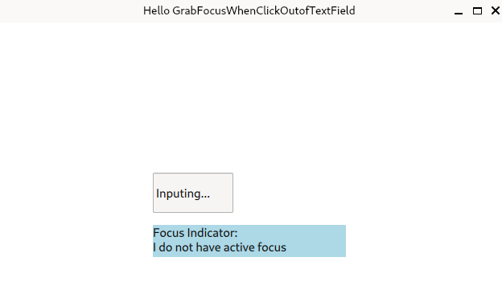
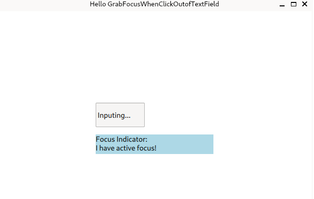

# Qt6.5 QtQuick make TextField lose focus when mouse click outside of it.
eton@241108

- V1.0:
 first editon

## Effects
1. focus in text field

2. when click , text field lose focus.

## ENV:
 - qt6.5
 - Debian12	
## Ref:
- [Keyboard Focus in Qt Quick](https://doc.qt.io/qt-6/qtquick-input-focus.html)
